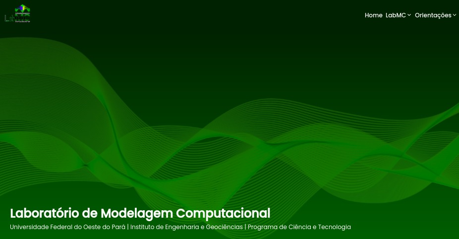

# Landingpage LabMC - Projeto de Estágio

Essa é uma solução para uma landingpage para divulgação das principais informações do Laboratório de Modelagem Computacional (LabMC).

## Tecnologias utilizadas

- Todo o projeto foi realizado utilizando o framework [AdonisJS](https://adonisjs.com/). Todos os processos seguiram então sua documentação oficial.

## Como rodar

Após instalar o [NodeJS](https://nodejs.org/en/), o [yarn](https://yarnpkg.com/), o [Docker](https://docs.docker.com/) e o [git](https://github.com/git-guides/install-git) siga os seguintes passos para ter o projeto na sua máquina.

1. Faça clone do repositório para a sua máquina.
2. Na pasta do projeto na sua máquina, rode o seguinte comando para instalar as dependências necessárias.

`yarn`

4. Criar um .env e copiar o que possui no .env.example substituindo os campos pelos devidos dados.

5. Rode o seguinte comando na pasta do projeto para ativar o container que possui o banco de dados Postgres a ser utilizado.

`docker compose up -d`

6. Para rodar o sistema utilize por fim

`yarn dev`

## Autor

- Meu perfil na Rocketseat - [Yasmin Braga](https://app.rocketseat.com.br/me/yasmin-braga-1568974763)
- FrontendMentor - [@yasminbraga](https://www.frontendmentor.io/profile/yasminbraga)
- Instagram - [@yasminbragat](https://www.twitter.com/yasminbragat)
- Twitter - [@minbragat](https://www.twitter.com/minbragat)

Made with :heart: by [Yasmin Braga](https://github.com/yasminbraga)
